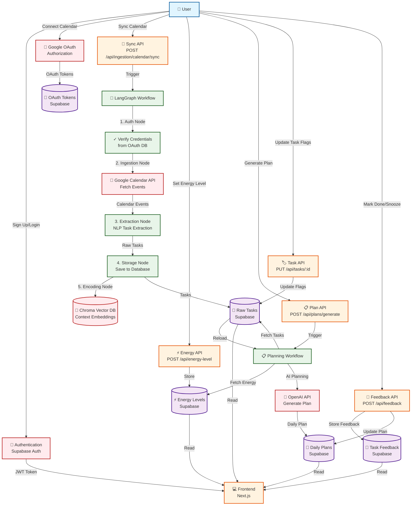

# 🧠 LifeFlow

> **Transform your to-do list into a done list** with AI-powered task management

LifeFlow is an intelligent cognitive control system designed to help you manage your day more effectively. It connects to your Google Calendar, automatically extracts tasks from events, and creates personalized daily plans based on your energy levels and priorities.

---

## ✨ What LifeFlow Does

LifeFlow acts as your personal executive function assistant, helping you:

- 📅 **Sync with Google Calendar** - Automatically import events and extract actionable tasks
- 🎯 **Smart Task Extraction** - Uses AI to identify tasks, deadlines, and priorities from calendar events
- ⚡ **Energy-Aware Planning** - Creates daily plans that match your energy levels
- 🏷️ **Priority Management** - Mark tasks as critical or urgent to focus on what matters
- 📊 **Track Progress** - Monitor your task completion and calendar sync metrics
- 💬 **Provide Feedback** - Help the system learn your preferences and improve over time

---

## 🔄 Data Flow

LifeFlow processes data through several interconnected workflows. Here's how information flows through the system:



### Key Data Flows Explained

1. **Authentication & Authorization**
   - User signs up/logs in → Supabase Auth generates JWT token
   - Google OAuth flow stores credentials securely for calendar access

2. **Calendar Sync Workflow** (LangGraph Orchestration)
   - User triggers sync → Workflow verifies OAuth credentials
   - Fetches events from Google Calendar API
   - Extracts tasks using NLP (title, description, attendees, etc.)
   - Stores tasks in Supabase database
   - Generates context embeddings in Chroma vector database

3. **Daily Plan Generation**
   - User sets energy level → Stored in database
   - User requests plan → System fetches:
     - Tasks from calendar sync
     - Current energy level
     - Task priorities (critical/urgent flags)
   - OpenAI generates personalized plan → Stored in database

4. **Task Management**
   - User updates task flags (critical/urgent) → Updates task in database
   - Changes trigger plan regeneration to reflect new priorities

5. **Feedback Loop**
   - User marks tasks as done or snoozes them → Feedback stored
   - Plan updated with task status changes
   - Feedback data used for future learning and improvements

---

## 🚀 Quick Start

### Prerequisites

Before you begin, make sure you have:

- **Python 3.11+** installed
- **Node.js 18+** installed
- A **Supabase account** (free tier works)
- A **Google Cloud project** with Calendar API enabled
- An **OpenAI API key**

> 💡 **New to these services?** Check out the [Environment Setup Guide](ENV_SETUP.md) for step-by-step instructions on getting your API keys and accounts set up.

---

## 📦 Installation

### Step 1: Clone the Repository

```bash
git clone <repository-url>
cd lifeflow
```

### Step 2: Set Up the Backend

1. **Navigate to the backend directory:**
   ```bash
   cd backend
   ```

2. **Create a virtual environment:**
   ```bash
   python -m venv venv
   source venv/bin/activate  # On Windows: venv\Scripts\activate
   ```

3. **Install dependencies:**
   ```bash
   pip install -r requirements.txt
   ```

4. **Configure environment variables:**
   ```bash
   # Create .env file (see ENV_SETUP.md for details)
   cp .env.example .env  # If example exists
   # Edit .env with your configuration
   ```

5. **Start the backend server:**
   ```bash
   uvicorn app.main:app --reload --host 0.0.0.0 --port 8000
   ```

   The backend will be available at `http://localhost:8000`

### Step 3: Set Up the Frontend

1. **Open a new terminal** and navigate to the frontend directory:
   ```bash
   cd frontend
   ```

2. **Install dependencies:**
   ```bash
   npm install
   ```

3. **Configure environment variables:**
   ```bash
   # Create .env.local file (see ENV_SETUP.md for details)
   cp .env.local.example .env.local  # If example exists
   # Edit .env.local with your configuration
   ```

4. **Start the development server:**
   ```bash
   npm run dev
   ```

   The frontend will be available at `http://localhost:3000`

### Step 4: Set Up the Database

1. **Create a Supabase project:**
   - Go to [supabase.com](https://supabase.com) and create a new project
   - Note your project URL and API keys

2. **Run database migrations:**
   - Open the Supabase SQL Editor
   - Copy and paste the contents of `supabase/migrations/001_initial_schema.sql`
   - Execute the migration

3. **Configure authentication:**
   - Enable Email provider in Supabase Auth settings
   - Enable Google OAuth provider
   - Add your Google OAuth credentials

---

## 🎮 How to Use LifeFlow

### 1. **Sign Up or Log In**

- Visit `http://localhost:3000`
- Create an account with your email, or sign in with Google
- You'll be redirected to your dashboard

### 2. **Connect Your Google Calendar**

- Click **"Connect Google Calendar"** on the dashboard
- Authorize LifeFlow to access your calendar
- Once connected, you'll see your sync status

### 3. **Sync Your Calendar**

- Click **"Sync Calendar"** to import events from your Google Calendar
- LifeFlow will automatically extract tasks from your calendar events
- View your extracted tasks in the "Raw Tasks" section

### 4. **Set Your Energy Level**

- Use the **Energy Level** widget to indicate how you're feeling today
- Choose from: Very Low, Low, Medium, High, or Very High
- This helps LifeFlow create a plan that matches your capacity

### 5. **Generate Your Daily Plan**

- Click **"Generate Plan"** to create a personalized daily plan
- The plan considers:
  - Your calendar events
  - Your energy level
  - Task priorities (critical/urgent flags)
  - Your task history

### 6. **Manage Your Tasks**

- View all extracted tasks in the dashboard
- Mark tasks as **Critical** or **Urgent** to prioritize them
- Provide feedback on tasks to help LifeFlow learn your preferences

### 7. **Track Your Progress**

- Monitor your sync metrics:
  - Success rate
  - Total events processed
  - Successful vs failed ingestions
- Review your daily plans and task completion

---

## 🏗️ Architecture

LifeFlow is built with modern, scalable technologies:

| Component | Technology | Purpose |
|-----------|-----------|---------|
| **Frontend** | Next.js 16 (TypeScript) | User interface and experience |
| **Backend** | FastAPI (Python) | API and agent services |
| **Database** | Supabase (PostgreSQL) | Relational data storage |
| **Vector DB** | Chroma | Context embeddings and behavior patterns |
| **Orchestration** | LangGraph | Multi-agent workflow management |
| **AI** | OpenAI API | Task extraction and planning |
| **Auth** | Supabase Auth | Secure user authentication |

---

## 📁 Project Structure

```
lifeflow/
├── backend/              # FastAPI backend
│   ├── app/
│   │   ├── agents/      # AI agent implementations
│   │   ├── api/         # REST API endpoints
│   │   ├── models/      # Data models
│   │   └── utils/       # Utilities and helpers
│   └── tests/           # Backend tests
├── frontend/             # Next.js frontend
│   ├── app/             # App Router pages
│   ├── components/      # React components
│   ├── src/
│   │   ├── lib/         # API clients and utilities
│   │   └── types/       # TypeScript type definitions
│   └── middleware.ts    # Route protection
└── supabase/            # Database migrations
    └── migrations/
```

---

## 🔧 Configuration

### Environment Variables

Both backend and frontend require environment variables to be configured. See [ENV_SETUP.md](ENV_SETUP.md) for detailed instructions on:

- Setting up Supabase credentials
- Configuring Google OAuth
- Adding your OpenAI API key
- Configuring Chroma vector database

### API Documentation

Once the backend is running, you can access:

- **Swagger UI**: http://localhost:8000/docs
- **ReDoc**: http://localhost:8000/redoc

---

## 🧪 Testing

### Backend Tests

```bash
cd backend
pytest
```

### Frontend Tests

```bash
cd frontend
npm test
```

---

## ✅ Current Features (Phase 1)

- ✅ **User Authentication** - Email and Google OAuth sign-in
- ✅ **Google Calendar Integration** - Connect and sync your calendar
- ✅ **Event Ingestion** - Automatic extraction of tasks from calendar events
- ✅ **NLP Task Extraction** - AI-powered task identification and parsing
- ✅ **Daily Plan Generation** - Personalized plans based on energy and priorities
- ✅ **Energy Level Tracking** - Set and track your daily energy levels
- ✅ **Task Management** - Mark tasks as critical or urgent
- ✅ **Feedback System** - Provide input to improve the system
- ✅ **Metrics Dashboard** - Monitor sync success rates and task statistics

---

## 🗺️ Roadmap

### Phase 2 (Coming Soon)

- 🚧 **Personal Context Encoding** - Learn your preferences and patterns
- 🚧 **Proactive Planning** - Predict blockers and suggest optimizations
- 🚧 **Real-Time Nudging** - Get timely reminders and suggestions
- 🚧 **Enhanced UI/UX** - Improved interface and user experience

---

## 📚 Additional Resources

- **[Environment Setup Guide](ENV_SETUP.md)** - Detailed instructions for configuring API keys and services
- **[Running Guide](RUNNING.md)** - Step-by-step instructions for running the application
- **[Phase 1 Validation](PHASE1_VALIDATION.md)** - Validation criteria and testing results

---

## 🤝 Contributing

This project is currently in active development. If you'd like to contribute, please:

1. Review the codebase structure
2. Check existing issues or create new ones
3. Follow the coding standards and best practices
4. Submit pull requests with clear descriptions

---

## 📄 License

MIT License - see LICENSE file for details

---

## 💡 Tips for Best Results

- **Sync regularly** - Keep your calendar synced to ensure tasks are up to date
- **Set energy levels** - Accurate energy levels help create better plans
- **Use priority flags** - Mark critical tasks to focus on what matters most
- **Provide feedback** - Help LifeFlow learn your preferences and improve

---

**Made with ❤️ to help you get things done**
