# 🧠 LifeFlow

> **Transform your to-do list into a done list** with AI-powered task management

LifeFlow is an intelligent cognitive control system designed to help you manage your day more effectively. It connects to your Google Calendar, automatically extracts tasks from events, and creates personalized daily plans based on your energy levels and priorities.

---

## ✨ What LifeFlow Does

LifeFlow acts as your personal executive function assistant, helping you:

- 📅 **Sync with Google Calendar** - Automatically import events and extract actionable tasks
- 🎯 **Smart Task Extraction** - Uses AI to identify tasks, deadlines, and priorities from calendar events
- ⚡ **Energy-Aware Planning** - Creates daily plans that match your energy levels
- 🏷️ **Priority Management** - Mark tasks as critical or urgent to focus on what matters
- 🔔 **Smart Notifications** - Receive timely micro-nudges when tasks are due to start
- 📧 **Email Reminders** - Get email notifications for important tasks (configurable)
- 📊 **Track Progress** - Monitor your task completion and calendar sync metrics
- 💬 **Provide Feedback** - Help the system learn your preferences and improve over time
- 🧠 **Context Learning** - System learns from your behavior patterns and preferences

---

## 🔄 Data Flow

LifeFlow processes data through several interconnected workflows. Here's how information flows through the system:

```mermaid
graph TB
    %% User Actions
    User[👤 User] -->|Sign Up/Login| Auth[🔐 Authentication<br/>Supabase Auth]
    User -->|Connect Calendar| GoogleOAuth[🔗 Google OAuth<br/>Authorization]
    User -->|Sync Calendar| SyncAPI[📡 Sync API<br/>POST /api/ingestion/calendar/sync]
    User -->|Set Energy Level| EnergyAPI[⚡ Energy API<br/>POST /api/energy-level]
    User -->|Generate Plan| PlanAPI[📋 Plan API<br/>POST /api/plans/generate]
    User -->|Update Task Flags| TaskAPI[🏷️ Task API<br/>PUT /api/tasks/:id]
    User -->|Mark Done/Snooze| FeedbackAPI[💬 Feedback API<br/>POST /api/feedback]
    User -->|View Notifications| NotifAPI[🔔 Notifications API<br/>GET /api/notifications]
    User -->|View Reminders| ReminderAPI[⏰ Reminders API<br/>GET /api/reminders]

    %% Authentication Flow
    Auth -->|JWT Token| Frontend[💻 Frontend<br/>Next.js]
    GoogleOAuth -->|OAuth Tokens| OAuthDB[(🔑 OAuth Tokens<br/>Supabase)]

    %% Calendar Sync Workflow
    SyncAPI -->|Trigger| Workflow{{🔄 LangGraph Workflow}}
    Workflow -->|1. Auth Node| VerifyCreds[✓ Verify Credentials<br/>from OAuth DB]
    VerifyCreds -->|2. Ingestion Node| GoogleAPI[📅 Google Calendar API<br/>Fetch Events]
    GoogleAPI -->|Calendar Events| ExtractNode{{3. Extraction Node<br/>NLP Task Extraction}}
    ExtractNode -->|Raw Tasks| StoreNode[4. Storage Node<br/>Save to Database]
    StoreNode -->|5. Encoding Node| Chroma[(🧠 Chroma Vector DB<br/>Context Embeddings)]
    StoreNode -->|Tasks| TasksDB[(📝 Raw Tasks<br/>Supabase)]

    %% Energy Level Flow
    EnergyAPI -->|Store| EnergyDB[(⚡ Energy Levels<br/>Supabase)]

    %% Plan Generation Flow
    PlanAPI -->|Trigger| PlanWorkflow{{📋 Planning Workflow}}
    PlanWorkflow -->|Fetch Tasks| TasksDB
    PlanWorkflow -->|Fetch Energy| EnergyDB
    PlanWorkflow -->|AI Planning| OpenAI{{🤖 OpenAI API<br/>Generate Plan}}
    OpenAI -->|Daily Plan| PlansDB[(📅 Daily Plans<br/>Supabase)]

    %% Task Management Flow
    TaskAPI -->|Update Flags| TasksDB
    TasksDB -->|Reload| PlanWorkflow

    %% Feedback Flow
    FeedbackAPI -->|Store Feedback| FeedbackDB[(💬 Task Feedback<br/>Supabase)]
    FeedbackAPI -->|Update Plan| PlansDB

    %% Notification Flow
    PlansDB -->|Scheduled Tasks| Scheduler{{⏰ Background Scheduler<br/>APScheduler}}
    Scheduler -->|Check Due Tasks| ActionAgent{{🎯 Action Agent<br/>Nudger}}
    ActionAgent -->|Create Notifications| NotifDB[(🔔 Notifications<br/>Supabase)]
    ActionAgent -->|Send Emails| EmailService[📧 Email Service<br/>SMTP]
    NotifDB -->|Read| NotifAPI
    NotifDB -->|Read| Frontend

    %% Reminder Flow
    PlansDB -->|Task Reminders| ReminderDB[(⏰ Reminders<br/>Supabase)]
    ReminderDB -->|Read| ReminderAPI
    ReminderDB -->|Read| Frontend

    %% Display Flow
    TasksDB -->|Read| Frontend
    PlansDB -->|Read| Frontend
    EnergyDB -->|Read| Frontend
    FeedbackDB -->|Read| Frontend

    %% Styling
    classDef userClass fill:#e1f5ff,stroke:#01579b,stroke-width:2px
    classDef apiClass fill:#fff3e0,stroke:#e65100,stroke-width:2px
    classDef dbClass fill:#f3e5f5,stroke:#4a148c,stroke-width:2px
    classDef agentClass fill:#fff9c4,stroke:#f57f17,stroke-width:3px
    classDef workflowClass fill:#e8f5e9,stroke:#1b5e20,stroke-width:2px
    classDef externalClass fill:#ffebee,stroke:#b71c1c,stroke-width:2px

    class User userClass
    class Frontend,SyncAPI,EnergyAPI,PlanAPI,TaskAPI,FeedbackAPI,NotifAPI,ReminderAPI apiClass
    class TasksDB,PlansDB,EnergyDB,FeedbackDB,OAuthDB,NotifDB,ReminderDB dbClass
    class Workflow,ExtractNode,PlanWorkflow,OpenAI,ActionAgent agentClass
    class VerifyCreds,StoreNode,Scheduler workflowClass
    class GoogleAPI,Chroma,Auth,GoogleOAuth,EmailService externalClass
```



### 🤖 Understanding Agents in the System

In the Data Flow Diagram above, **agents** are AI-powered components that make intelligent decisions and process information autonomously. **Agents are visually distinguished by their hexagon shape** (similar to how databases use cylinders). Here's how to identify them:

#### **Agent Components** (AI-Powered):

1. **🔄 LangGraph Workflow** (Calendar Sync Workflow)
   - **What it is**: An orchestration agent that coordinates multiple steps
   - **Why it's an agent**: It makes decisions about workflow execution, handles errors, and manages the sequence of operations
   - **What it does**: Coordinates the entire calendar sync process from start to finish

2. **3. Extraction Node** (NLP Task Extraction)
   - **What it is**: An AI agent that analyzes calendar events
   - **Why it's an agent**: Uses Natural Language Processing (NLP) to intelligently identify tasks, deadlines, and priorities from unstructured text
   - **What it does**: Reads calendar event titles, descriptions, and attendees to extract actionable tasks

3. **📋 Planning Workflow**
   - **What it is**: An orchestration agent for plan generation
   - **Why it's an agent**: Makes decisions about which tasks to include, how to prioritize them, and when to schedule them
   - **What it does**: Coordinates fetching data and generating personalized daily plans

4. **🤖 OpenAI API** (Generate Plan)
   - **What it is**: A large language model agent
   - **Why it's an agent**: Uses AI to understand context, energy levels, and priorities to create personalized plans
   - **What it does**: Generates human-readable daily plans that match your capacity and goals

5. **🎯 Action Agent** (Nudger)
   - **What it is**: An agent that monitors scheduled tasks and triggers notifications
   - **Why it's an agent**: Makes intelligent decisions about when to send notifications based on task timing and priority
   - **What it does**: Checks for tasks due to start, creates notifications, and sends email reminders

#### **Non-Agent Components** (Standard System Components):

- **APIs** (Sync API, Energy API, Plan API, etc.) - These are simple endpoints that receive requests and return responses
- **Databases** (Supabase, Chroma) - These store and retrieve data but don't make decisions
- **External Services** (Google Calendar API, Supabase Auth) - These are third-party services that provide data or authentication
- **Frontend** - The user interface that displays information and collects input

#### **Key Difference**:

**Agents** = Components that use AI/ML to make decisions, understand context, and adapt their behavior  
**Non-Agents** = Components that follow fixed rules, store data, or provide simple services

**Visual Identification**: In the diagram above, agents appear as **hexagons** (🟡 yellow/gold color), databases appear as **cylinders** (🟣 purple), APIs appear as **rectangles** (🟠 orange), and workflows appear as **rectangles** (🟢 green).

The agents work together to create an intelligent system that learns from your behavior and adapts to your needs over time.

---

### Key Data Flows Explained

1. **Authentication & Authorization**
   - User signs up/logs in → Supabase Auth generates JWT token
   - Google OAuth flow stores credentials securely for calendar access

2. **Calendar Sync Workflow** (LangGraph Orchestration)
   - User triggers sync → Workflow verifies OAuth credentials
   - Fetches events from Google Calendar API
   - Extracts tasks using NLP (title, description, attendees, etc.)
   - Stores tasks in Supabase database
   - Generates context embeddings in Chroma vector database

3. **Daily Plan Generation**
   - User sets energy level → Stored in database
   - User requests plan → System fetches:
     - Tasks from calendar sync
     - Current energy level
     - Task priorities (critical/urgent flags)
   - OpenAI generates personalized plan → Stored in database

4. **Task Management**
   - User updates task flags (critical/urgent) → Updates task in database
   - Changes trigger plan regeneration to reflect new priorities

5. **Notification & Reminder System**
   - Background scheduler runs every 2 minutes → Checks for tasks due in next 5 minutes
   - Action Agent creates notifications → Stored in database
   - Notifications sent via in-app display and email (if configured)
   - Users can view and dismiss notifications in the dashboard

6. **Feedback Loop**
   - User marks tasks as done or snoozes them → Feedback stored
   - Plan updated with task status changes
   - Feedback data used for future learning and improvements

7. **Context Encoding & Learning**
   - Task context embeddings stored in Chroma vector database
   - System learns from user preferences and behavior patterns
   - Context used to improve future plan generation

---

## 🚀 Quick Start

### Prerequisites

Before you begin, make sure you have:

- **Python 3.11+** installed
- **Node.js 18+** installed
- A **Supabase account** (free tier works)
- A **Google Cloud project** with Calendar API enabled
- An **OpenAI API key**

> 💡 **New to these services?** Check out the [Environment Setup Guide](ENV_SETUP.md) for step-by-step instructions on getting your API keys and accounts set up.

---

## 📦 Installation

### Step 1: Clone the Repository

```bash
git clone <repository-url>
cd lifeflow
```

### Step 2: Set Up the Backend

1. **Navigate to the backend directory:**
   ```bash
   cd backend
   ```

2. **Create a virtual environment:**
   ```bash
   python -m venv venv
   source venv/bin/activate  # On Windows: venv\Scripts\activate
   ```

3. **Install dependencies:**
   ```bash
   pip install -r requirements.txt
   ```

4. **Configure environment variables:**
   ```bash
   # Create .env file (see ENV_SETUP.md for details)
   cp .env.example .env  # If example exists
   # Edit .env with your configuration
   ```

5. **Start the backend server:**
   ```bash
   uvicorn app.main:app --reload --host 0.0.0.0 --port 8000
   ```

   The backend will be available at `http://localhost:8000`

### Step 3: Set Up the Frontend

1. **Open a new terminal** and navigate to the frontend directory:
   ```bash
   cd frontend
   ```

2. **Install dependencies:**
   ```bash
   npm install
   ```

3. **Configure environment variables:**
   ```bash
   # Create .env.local file (see ENV_SETUP.md for details)
   cp .env.local.example .env.local  # If example exists
   # Edit .env.local with your configuration
   ```

4. **Start the development server:**
   ```bash
   npm run dev
   ```

   The frontend will be available at `http://localhost:3000`

### Step 4: Set Up the Database

1. **Create a Supabase project:**
   - Go to [supabase.com](https://supabase.com) and create a new project
   - Note your project URL and API keys

2. **Run database migrations:**
   - Open the Supabase SQL Editor
   - Run migrations in order:
     - `supabase/migrations/001_initial_schema.sql` - Core tables (user_profiles, oauth_tokens, raw_tasks)
     - `supabase/migrations/002_phase2_schema.sql` - Daily plans and energy levels
     - `supabase/migrations/003_phase3_notifications.sql` - Notifications and reminders
     - `supabase/migrations/004_get_user_email_function.sql` - Email lookup function
   - Execute each migration sequentially

3. **Configure authentication:**
   - Enable Email provider in Supabase Auth settings
   - Enable Google OAuth provider
   - Add your Google OAuth credentials

---

## 🎮 How to Use LifeFlow

### 1. **Sign Up or Log In**

- Visit `http://localhost:3000`
- Create an account with your email, or sign in with Google
- You'll be redirected to your dashboard

### 2. **Connect Your Google Calendar**

- Click **"Connect Google Calendar"** on the dashboard
- Authorize LifeFlow to access your calendar
- Once connected, you'll see your sync status

### 3. **Sync Your Calendar**

- Click **"Sync Calendar"** to import events from your Google Calendar
- LifeFlow will automatically extract tasks from your calendar events
- View your extracted tasks in the "Raw Tasks" section

### 4. **Set Your Energy Level**

- Use the **Energy Level** widget to indicate how you're feeling today
- Choose from: Very Low, Low, Medium, High, or Very High
- This helps LifeFlow create a plan that matches your capacity

### 5. **Generate Your Daily Plan**

- Click **"Generate Plan"** to create a personalized daily plan
- The plan considers:
  - Your calendar events
  - Your energy level
  - Task priorities (critical/urgent flags)
  - Your task history

### 6. **Manage Your Tasks**

- View all extracted tasks in the dashboard
- Mark tasks as **Critical** or **Urgent** to prioritize them
- Provide feedback on tasks to help LifeFlow learn your preferences

### 7. **Receive Notifications & Reminders**

- **In-App Notifications**: View notifications in the dashboard's notification center
- **Email Notifications**: Receive email reminders for tasks (configure SMTP settings)
- Notifications are automatically sent when tasks are due to start
- Dismiss notifications as you complete tasks

### 8. **Track Your Progress**

- Monitor your sync metrics:
  - Success rate
  - Total events processed
  - Successful vs failed ingestions
- Review your daily plans and task completion
- View notification history and feedback

---

## 🏗️ Architecture

LifeFlow is built with modern, scalable technologies:

| Component | Technology | Purpose |
|-----------|-----------|---------|
| **Frontend** | Next.js 16, React 19 (TypeScript) | User interface and experience |
| **Backend** | FastAPI (Python 3.11+) | API and agent services |
| **Database** | Supabase (PostgreSQL) | Relational data storage |
| **Vector DB** | Chroma | Context embeddings and behavior patterns |
| **Orchestration** | LangGraph | Multi-agent workflow management |
| **Scheduler** | APScheduler | Background task scheduling for notifications |
| **AI** | OpenAI API | Task extraction and planning |
| **Auth** | Supabase Auth | Secure user authentication |
| **Email** | SMTP (Gmail/SendGrid/etc.) | Email notifications |

---

## 📁 Project Structure

```
lifeflow/
├── backend/              # FastAPI backend
│   ├── app/
│   │   ├── agents/      # AI agent implementations
│   │   │   ├── action/  # Action agents (nudger)
│   │   │   ├── cognition/ # Cognition agents (encoding, planner, learning)
│   │   │   ├── orchestration/ # LangGraph workflows
│   │   │   └── perception/ # Perception agents (ingestion, NLP extraction)
│   │   ├── api/         # REST API endpoints
│   │   ├── models/      # Data models
│   │   └── utils/       # Utilities and helpers (scheduler, monitoring)
│   └── tests/           # Backend tests
├── frontend/             # Next.js frontend
│   ├── app/             # App Router pages
│   │   ├── auth/        # Authentication pages
│   │   └── dashboard/   # Main dashboard page
│   ├── components/      # React components
│   │   ├── DailyPlanView.tsx
│   │   ├── EnergyLevelInput.tsx
│   │   ├── NotificationCenter.tsx
│   │   ├── RawTasksView.tsx
│   │   ├── RemindersView.tsx
│   │   └── TaskFeedback.tsx
│   ├── src/
│   │   ├── lib/         # API clients and utilities
│   │   └── types/       # TypeScript type definitions
│   └── middleware.ts    # Route protection
└── supabase/            # Database migrations
    └── migrations/
        ├── 001_initial_schema.sql
        ├── 002_phase2_schema.sql
        ├── 003_phase3_notifications.sql
        └── 004_get_user_email_function.sql
```

---

## 🔧 Configuration

### Environment Variables

Both backend and frontend require environment variables to be configured. See [ENV_SETUP.md](ENV_SETUP.md) for detailed instructions on:

- Setting up Supabase credentials
- Configuring Google OAuth
- Adding your OpenAI API key
- Configuring Chroma vector database
- Configuring email notifications (SMTP settings) - See [PHASE3_NOTIFICATIONS.md](PHASE3_NOTIFICATIONS.md)

### API Documentation

Once the backend is running, you can access:

- **Swagger UI**: http://localhost:8000/docs
- **ReDoc**: http://localhost:8000/redoc

---

## 🧪 Testing

### Backend Tests

```bash
cd backend
pytest
```

### Frontend Tests

```bash
cd frontend
npm test
```

---

## ✅ Current Features

### Phase 1: Core Functionality ✅
- ✅ **User Authentication** - Email and Google OAuth sign-in
- ✅ **Google Calendar Integration** - Connect and sync your calendar
- ✅ **Event Ingestion** - Automatic extraction of tasks from calendar events
- ✅ **NLP Task Extraction** - AI-powered task identification and parsing
- ✅ **Daily Plan Generation** - Personalized plans based on energy and priorities
- ✅ **Energy Level Tracking** - Set and track your daily energy levels
- ✅ **Task Management** - Mark tasks as critical or urgent
- ✅ **Feedback System** - Provide input to improve the system
- ✅ **Metrics Dashboard** - Monitor sync success rates and task statistics

### Phase 2: Context & Learning ✅
- ✅ **Personal Context Encoding** - Task context embeddings stored in Chroma vector database
- ✅ **Daily Plans with Energy Levels** - Plans generated considering user's energy state
- ✅ **Task Priority Flags** - Critical and urgent flags for task prioritization
- ✅ **Learning System** - System learns from user behavior and feedback patterns

### Phase 3: Notifications & Reminders ✅
- ✅ **In-App Notifications** - Real-time notification center in dashboard
- ✅ **Email Notifications** - Configurable email reminders for tasks
- ✅ **Background Scheduler** - Automatic task monitoring every 2 minutes
- ✅ **Smart Nudging** - Micro-nudges sent when tasks are due to start
- ✅ **Reminders System** - View and manage task reminders
- ✅ **Notification Management** - Dismiss and track notification history

---

## 🗺️ Roadmap

### Phase 4 (Future Enhancements)

- 🚧 **Proactive Planning** - Predict blockers and suggest optimizations
- 🚧 **Advanced Analytics** - Deeper insights into productivity patterns
- 🚧 **Enhanced UI/UX** - Improved interface and user experience
- 🚧 **Mobile App** - Native mobile applications for iOS and Android
- 🚧 **Multi-Calendar Support** - Support for multiple calendar sources
- 🚧 **Team Collaboration** - Share plans and tasks with team members

---

## 📚 Additional Resources

- **[Environment Setup Guide](ENV_SETUP.md)** - Detailed instructions for configuring API keys and services
- **[Running Guide](RUNNING.md)** - Step-by-step instructions for running the application
- **[Phase 1 Validation](PHASE1_VALIDATION.md)** - Validation criteria and testing results
- **[Phase 3 Notifications](PHASE3_NOTIFICATIONS.md)** - Notification system documentation and configuration
- **[Google OAuth Setup](GOOGLE_OAUTH_SETUP.md)** - Step-by-step Google OAuth configuration guide
- **[Backend Deployment](BACKEND_DEPLOYMENT.md)** - Guide for deploying the backend to production
- **[Quick Deploy](QUICK_DEPLOY.md)** - Quick deployment instructions

---

## 🤝 Contributing

This project is currently in active development. If you'd like to contribute, please:

1. Review the codebase structure
2. Check existing issues or create new ones
3. Follow the coding standards and best practices
4. Submit pull requests with clear descriptions

---

## 📄 License

MIT License - see LICENSE file for details

---

## 💡 Tips for Best Results

- **Sync regularly** - Keep your calendar synced to ensure tasks are up to date
- **Set energy levels** - Accurate energy levels help create better plans
- **Use priority flags** - Mark critical tasks to focus on what matters most
- **Enable email notifications** - Configure SMTP settings to receive email reminders
- **Check notifications** - Review the notification center regularly for timely task reminders
- **Provide feedback** - Help LifeFlow learn your preferences and improve
- **Generate daily plans** - Create plans each morning to optimize your day

---

**Made with ❤️ to help you get things done**
